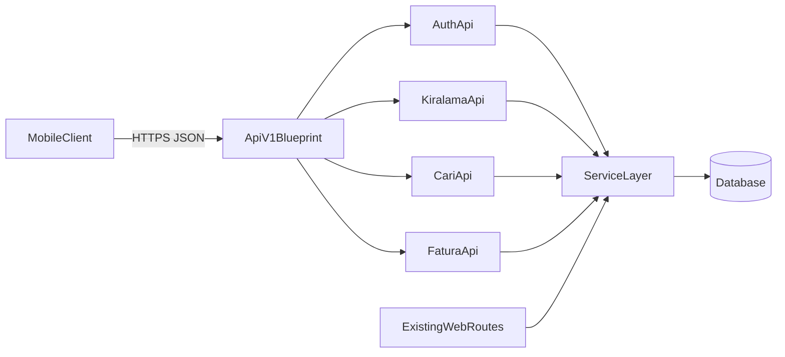

# Mobil API MVP Planı

## Hedef
Mevcut web akışlarını koruyarak mobil uygulamanın hızlı ve stabil çalışacağı, tutarlı JSON dönen bir API katmanı oluşturmak.

## Mevcut Durumdan Yararlanma
- Uygulama girişi ve blueprint kayıtları: [`C:/Users/cuney/Drive'ım/kiralama_projesi_v4/app/__init__.py`](C:/Users/cuney/Drive'ım/kiralama_projesi_v4/app/__init__.py), [`C:/Users/cuney/Drive'ım/kiralama_projesi_v4/run.py`](C:/Users/cuney/Drive'ım/kiralama_projesi_v4/run.py)
- Session tabanlı mevcut auth: [`C:/Users/cuney/Drive'ım/kiralama_projesi_v4/app/auth/routes.py`](C:/Users/cuney/Drive'ım/kiralama_projesi_v4/app/auth/routes.py), kullanıcı/rol modeli: [`C:/Users/cuney/Drive'ım/kiralama_projesi_v4/app/auth/models.py`](C:/Users/cuney/Drive'ım/kiralama_projesi_v4/app/auth/models.py)
- İş kuralları zaten servis katmanında: [`C:/Users/cuney/Drive'ım/kiralama_projesi_v4/app/services/kiralama_services.py`](C:/Users/cuney/Drive'ım/kiralama_projesi_v4/app/services/kiralama_services.py), [`C:/Users/cuney/Drive'ım/kiralama_projesi_v4/app/services/cari_services.py`](C:/Users/cuney/Drive'ım/kiralama_projesi_v4/app/services/cari_services.py), [`C:/Users/cuney/Drive'ım/kiralama_projesi_v4/app/services/fatura_services.py`](C:/Users/cuney/Drive'ım/kiralama_projesi_v4/app/services/fatura_services.py)

## Önerilen Mimari
- Yeni API paketi: `app/api/`
- Yeni blueprint: `/api/v1`
- Web route’ları ve template akışları aynen kalır; API route’ları paralel çalışır.
- Response standardı: `{ data, meta, error }` yapısı
- Yetkilendirme: mevcut kullanıcı/rol yapısını koruyarak JWT (access + refresh) doğrulama katmanı

## MVP Kapsamı (Hepsinin Temel Versiyonu)
- Auth/Kullanıcı: JWT login, refresh, current-user, logout (mevcut kullanıcı/rol mantığıyla uyumlu)
- Kiralama: listeleme + detay + temel durum güncelleme
- Makineler: `/api/v1/makineler` listeleme + detay + filtreleme (müsaitlik/şube/durum)
- Cari/Ödeme: müşteri arama + temel ödeme/tahsilat kaydı
- Fatura: listeleme + temel durum/özet endpointleri
- Bildirim/Takvim: event listeleme (mevcut takvim akışından)

## Aşamalı Uygulama
1. `app/api` iskeleti, blueprint kaydı ve ortak JSON hata/response yardımcıları
2. Auth API endpointleri (`/api/v1/auth/login`, `/api/v1/auth/refresh`, `/api/v1/auth/me`, `/api/v1/auth/logout`) ve JWT doğrulama middleware’i
3. Kiralama, makineler, cari, fatura, takvim endpointlerinin servis katmanını kullanarak JSON’a taşınması
4. Sayfalama/filtreleme/sıralama standartlarının endpointlere eklenmesi
5. API entegrasyon testleri (`pytest`) ve temel performans doğrulaması
6. Mevcut kısmi JSON endpointlerinin (`/kiralama/api/...`, `/cari/api/...` vb.) yeni standartla hizalanması veya deprecate edilmesi

## Kabul Kriterleri
- Mobil uygulama tüm MVP modülleri için yalnızca `/api/v1` üzerinden veri alabilir
- `/api/v1/makineler` endpointi mobil listeleme/detay ihtiyacını karşılar
- Tüm API endpointleri tutarlı JSON formatı döner
- Yetkisiz istekler standart hata modeli ile reddedilir
- JWT access/refresh akışı güvenli ve testlerle doğrulanmış olur
- Web ekranları mevcut davranışını korur (regresyon yok)
- Temel endpointlerde sayfalama ve filtreleme çalışır